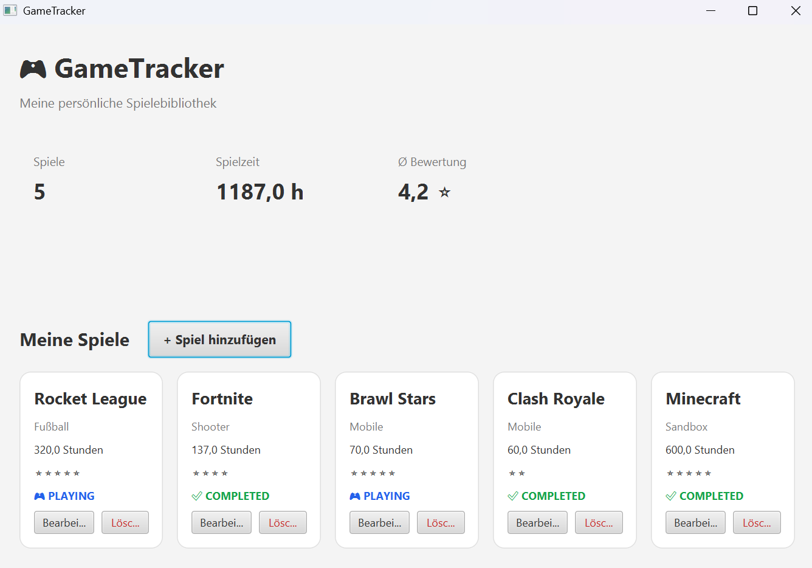

# 🎮 GameTracker

Eine JavaFX-Desktopanwendung zur Verwaltung einer persönlichen Spielebibliothek.

Mit der Anwendung können Spiele hinzugefügt, bearbeitet und gelöscht sowie Spielzeit, Bewertung und Spielstatus verwaltet werden. Die Spieldaten werden dauerhaft in einer JSON-Datei gespeichert.

## ✨ Features

* Spiele hinzufügen, bearbeiten und löschen
* Spielname und Genre verwalten
* Spielzeit erfassen
* Bewertung von 0 bis 5 Sternen
* Spielstatus verwalten:

  * `BACKLOG`
  * `PLAYING`
  * `COMPLETED`
* Automatische Statistiken:

  * Anzahl der Spiele
  * Gesamte Spielzeit
  * Durchschnittliche Bewertung
* Automatisches Speichern und Laden der Spieldaten
* JSON-basierte Datenspeicherung
* Validierung ungültiger Eingaben
* Grafische Benutzeroberfläche mit JavaFX

## 🛠️ Technologien

* **Java 21**
* **JavaFX**
* **Maven**
* **Jackson**
* **Objektorientierte Programmierung (OOP)**

## 🏗️ Projektstruktur

```text
gaming-tracker/
│
├── data/
│   └── games.json
│
├── src/
│   ├── main/
│   │   └── java/
│   │       └── com/
│   │           └── gamingtracker/
│   │               ├── App.java
│   │               ├── model/
│   │               │   ├── Game.java
│   │               │   └── GameStatus.java
│   │               └── service/
│   │                   ├── GameLibrary.java
│   │                   └── GameRepository.java
│   │
│   └── test/
│
├── pom.xml
├── README.md
└── .gitignore
```

## 💾 Datenhaltung

Die Spiele werden in der Datei `data/games.json` gespeichert.

Beim Start der Anwendung werden vorhandene Spiele automatisch geladen. Änderungen durch Hinzufügen, Bearbeiten oder Löschen werden direkt in der JSON-Datei gespeichert.

Für die Verarbeitung der JSON-Daten wird **Jackson** verwendet.

## ▶️ Anwendung starten

### Voraussetzungen

* JDK 21
* Maven

### Repository klonen

```bash
git clone DEIN_GITHUB_LINK
```

### In den Projektordner wechseln

```bash
cd gaming-tracker
```

### Anwendung starten

```bash
mvn clean javafx:run
```

## 📸 Screenshot



## 🎯 Projektziel

Das Projekt wurde entwickelt, um praktische Erfahrungen mit Java, objektorientierter Programmierung und der Entwicklung grafischer Desktopanwendungen zu sammeln.

Dabei wurden unter anderem Klassenstrukturen, Enums, Collections, Event Handling, Validierung und persistente Datenspeicherung umgesetzt.

## 🔮 Mögliche Erweiterungen

* Such- und Filterfunktion
* Sortierung nach Bewertung oder Spielzeit
* Detailliertere Statistiken
* Kategorien und Tags
* Datenbank statt JSON-Speicherung
